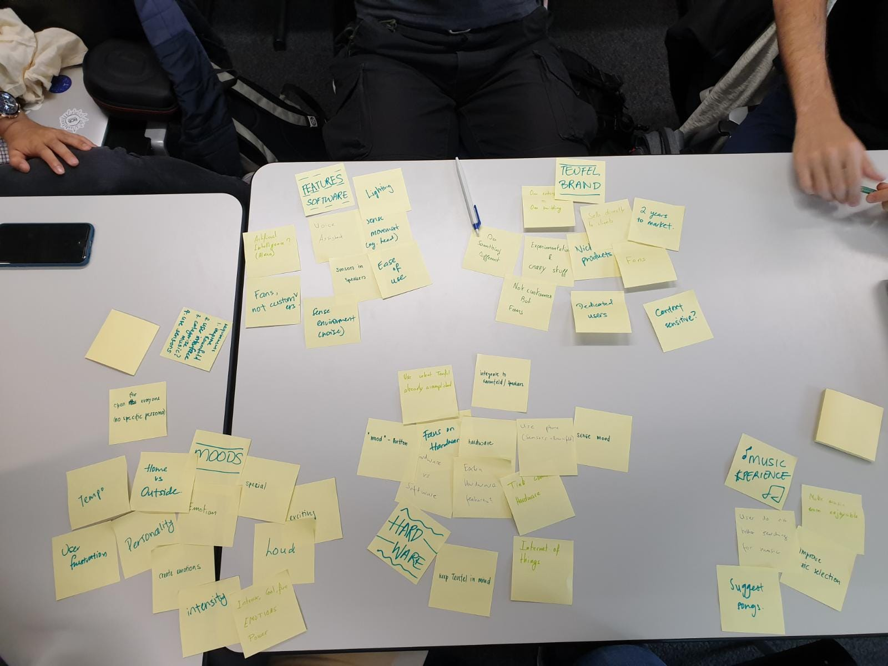
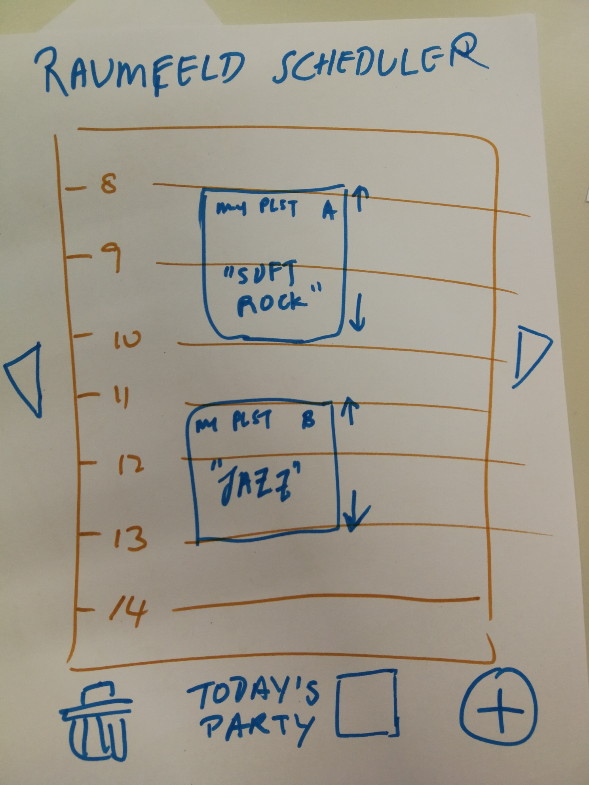
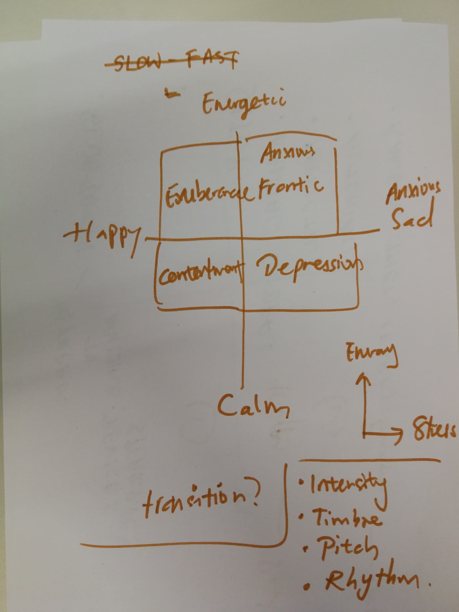
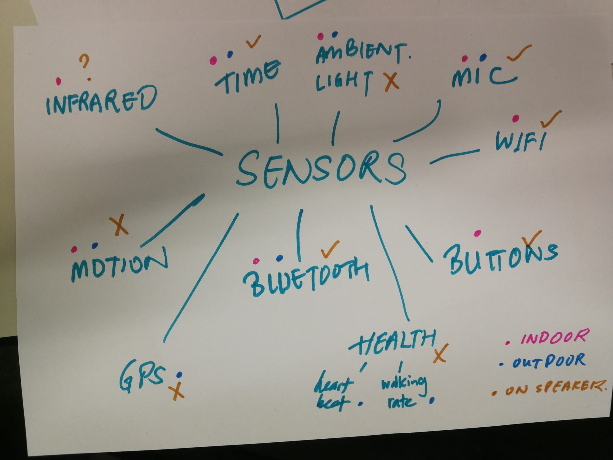
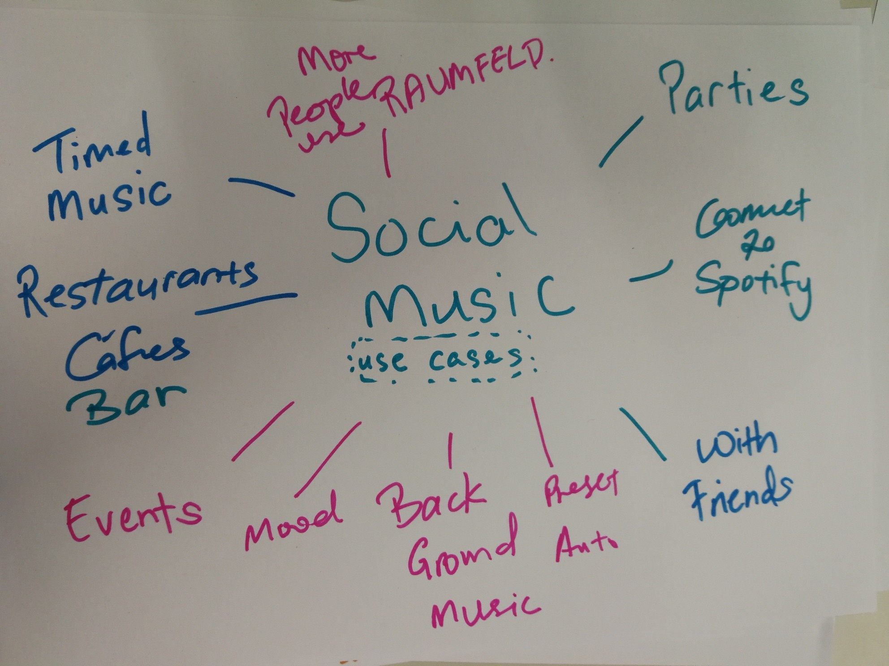
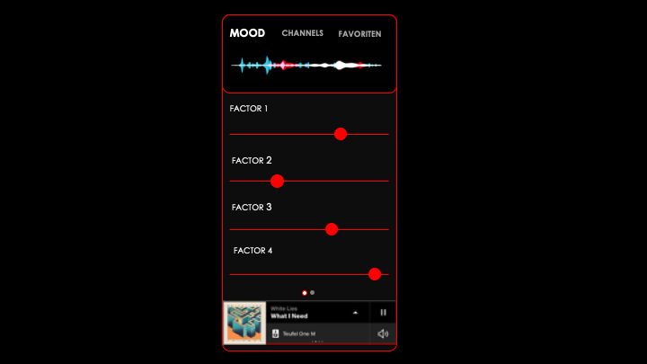
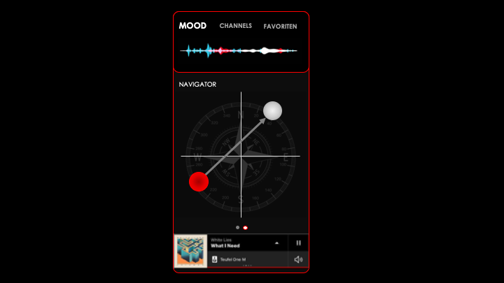
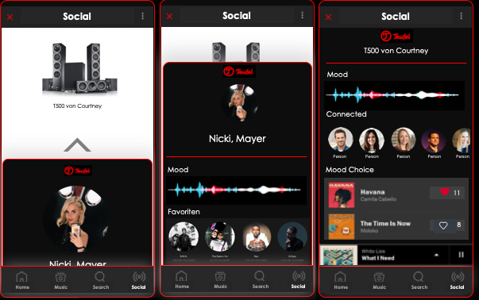

   

# Sense Users' Musical Mood, Group 11
#### Nathaniel, Florian, Alexandre, Livio, Timon

## Project description
Teufel is a German company focused on providing their clients with excitement in form of music. They offer a big variety of speakers and headsets with all of them focusing on intensity and emotions.

Everybody listens to music! The goal is to bring the music system a step further and allow a more dynamic and automated music experience to the user. Instead of constantly having to search through playlists to find a good song to play the user should be provided with music whenever and wherever he is. We are looking for more ways to make music more enjoyable.

## Ideas

### Requirements
- Be able to find/discover/select the next song easily
- Create a seamless music experience across multiple devices/speakers
- Reduce interaction time needed to control music devices (improve on user experience of plug in earphones/turn on home speaker, pulling out smartphone, unlock phone, open Spotify, start play button)
- No need for extra hardware to carry with (using native speaker hardware or phone)

### Personas

Who are the users?
We came up with three interest groups and a concrete samples of a person that fits the given lifestyles.

#### Peter, 62

Senior System Administrator: misses the good old days of radio. Listens to a lot of music but he always gets interrupted by colleagues. Stressful job, wants to put on headphones and then just have some music going. Doesn’t want to be bothered getting out the phone all the time just to adjust the music.

#### John, 28

Construction worker: Casually listens to music. But if he feels like he needs some music, he just wants to put on headphones and have some good music started. Doesn’t want to search ages for some music track he could listen to right now. Most of the time he just listens to the weekly discovery in spotify since he doesn't has any extensive playlists.

#### Courtney, 21

Instagram Influencer: Plans out all details of her life and takes pictures of everything. Takes public transportation to move between photo shoots, cafe hopping and bringing her dog on walks. Has tons of playlists and songs saved for each given task. Listens to her specific songs given what she is doing right now and how she is feeling. She has different playlists for doing yoga, go running, studying, hanging out with friends and going to bed but also for when she feels sad, lonely or when she is happy and excited.

### Affinity Clusters

#### Software Features
- Artifical Intelligence
- Voice Control (Alexa, Siri, ...)
- Extension to existing Raumfeld App

#### Teufel Brand
- Do it different
- Niche products
- Experimental & crazy stuff
- Fans as customers
- Direct resell to customers

#### Music Experience
- Make music more enjoyable
- Boost emotions
- Improve music selection
- Support current ambience
- Suggest songs
- Reduce burden of searching for music 

#### Hardware
- Mood Button
- Lightning Sensor
- Microphone

#### Moods/Emotions/Experience
- Intense, cool, fun
- Loud
- Exciting

### Key Ideas
Out of over 50 ideas we generated the following two key areas

#### Seamless hardware-software integration
First of all, we want to achieve a fuss free transition between devices. If you leave the house you should have to press a minimum amount of buttons to keep the music playing on your headphones which was previously playing on the speaker. Preferably those transitions are hands-free. We could even take advantage of Smart Home integration. We also want to provide continuity by having the music play where you left the last time. Were you in the middle of an awesome playlist? It will continue playing when you put your headphones back on!  
Additionally we want to achieve a radio effect by allowing multiple people listening to the same music together. Potentially even across large distances. The music played should be automatically determined using common music preferences.

#### Data-driven music
Secondly, we need to understand our users through phone and sensor data such as location (GPS), date/time, seasons/holidays, local weather, calendar acvitities, activity and health data. Additionally we want to try understand our user through social media that could help us determine their overall mood and music preferences. This includes listening patterns on streaming services and understanding the user's habits such as how often music is played and what type of music according to a given context.  
Using sensors in the phone such as the microphone and acceleration sensor we can additionally reveal more information about the mood the user currently is in.

### Initial project ideas

See [our presentation](Deliverables/presentation_ideas_10_18.pdf) for the detailed write-up.

#### The Big Teufel Button
A Surprise me button that features easy-to use instant-music.

#### Blast to the Past
Reminder of music you liked to play to boost your mood. Map locations to music to bring you back on a mind trip through old times.

#### Social Music
Use information from the environment (volume, amout of people, devices nearby) to select according playlists to match the mood of all guests.

### Feedback from Stakeholder
After a discussion with our stakeholder we came to the following conclusion:  
The Big Teufel Button is a very good idea isn't as strong as the other's as you are quite limited in the amount of options you have to go from there. Blast to the Past is the most emotional option, which is always a big Factor for Teufel, but our Social Music idea has the most potential for Teufel overall.  
Therefore we agreed to proceed with a focus of a social feature and the usage of sensors to detect, display and adjust a user's mood and integrate it into his music lifestyle. We therefore build a prototype based on the existing Raumfeld mobile app and won't focus on hardware itself.

## Prototyping

### First draft

 
   
   
During prototyping we are focusing on the potential features and user interfaces for Teufel's Raumfeld app.
The goal is to provide an interface to the user to display his current (automatically detected) mood in a readable format and give the user the possbility to adjust it accordingly.
To represent the mood we have to find the right keywords to specify a given mood state which are understandable for the general user.

Furthermore there are multiple options on how to display those options to the user. As a reference we looked at the screen brightness settings on a smartphone. The inital brightness is detected by the system but the user can still easily interact with a slider to adjust the brightness according to his/her liking.

The first option is to dislay each factor seperately using sliders. This way the user can specifically adjust each factor separately but in return might be overwhelmed by the amount of options.

The second interface uses a navigator in a 2D grid that can freely be moved around. Depending on where on the grid we find ourself, the chosen factors on the axis are taken into consideration according to the distance to the center of the grid. This allows for a very fast and easy adjustment but losing out on the option of fine-tuning each factor itself. There is also an option to gradually move the slider to the next position to achieve a smooth "mood transition".

In addition we want to implement a social feature where the mood state of multiple present people are taken into account to create and/or adjust a playlist that is currently played. By extending the Raumfeld app and the current mood of the user the user can perform a shake gesture with his phone towards a Teufel speaker which then takes the user's mood into account. By having multiple people doing that the music will match the general mood of the room.

    
## Evaluation

In a first iteration we want to find out what factors are used best to help identify a user's mood and how to assign those factors to a given song.

To do so we set up a survey that first asks the user to select factors which the user associates most with mood. This will help us determine which factors we should use on the interface.
In the second step the user listens to three different songs and has to determine for each given factor how much that song corresponds to a given factor. For example in a classic piece of Mozart the "dancability" factor is expected to be very low.

The attribute words we chose to evaluate were: loudness, happiness, speechiness, tempo, energy, danceability.

We conducted a survey asking users to rate 3 songs based on these attributes. The results were as follows:

We then compared these values to the values provided to us by Spotify:

Based on the results of the initial survey, it was not clear if there was a subset of distinguishing characteristics that users would likely be able to . There was a wide spread in opinion amongst respondents. However in terms of accuracy (compared with the Spotify-generated feature values), loudness, energy and happiness topped the list in being consistent compared to user's understandings of the attribute words.

Since those results were not giving us more progress towards a more refined prototype we decided to conduct a second survey that is focused more on a concrete instance of a prototype. To read more about or studies, check out the Study Report.

### Study Report
To see our full study including results: [Study Report (pdf)](Deliverables/study_report_group_11.pdf)   

### Feedback from Stakeholder

After presenting our results to Viktor, our stakeholder, we came to the conclusion that we should put algorithmis details aside since it is a very complex area and unfortunately out of scope for this project. We should more focus on the userface and the integration into the user's daily life.
Additionally, we agreed that the Navigator is a very good, fast and intuitive interface but it won't be enough as a standalone. We should therefore still support a second advanced option for users that want to adjust their mood/music setting in more detail. This can be done using our Slider prototype and an option to define or restrict the genre.

## Final solution

TODO: maybe describe the two big features (discovery/social) more extensively. How they work and all the cool stuff you can do with them.

With the limitation in mind that we don't focus in the sensoring part and have the mood input data for the user given, we worked out the following features for the mobile app Raumfeld.

- Easily display and modify the user's current mood using the Navigator interface. You can even enable a transition between two states in the Navigator such that the music adjusts over time from one mood setting to the other!

- If you want to go into pro-mode, you can use our Slider interface which allows a precise definition of the genre you are looking for and the corresponding mood attributes. This way you can restrict the potential music results much better and an improved satisfaction with the music provided by our system will be achieved.

- Depending on where you are currently at and how many people are around you (or how loud it is) the attributes in the mood setting may change. If you are on a party with a lot of people, the attributes will include keywords such as dancability while on a relaxed walk in the park attributes such as ambiance will take over as the prevalent setting.

- If you meet up with other people, use our Social feature! Mix your current mood and preferences with the other users around you. Based on the group's combined mood setting the music will adjust accordingly and provide you with a good sound for everyone's pleasure.  
You can still take direct influence in what is played and you get help in creating a playlist by receiving suggestions on potential songs that fit in perfectly.

- Bring in your own mood to an ongoing playlist that is powered by Raumfeld by bumping your phone to the speaker! This will transfer your mood setting and your music preferences to the host's system and mix the mood together. Don't lose any time in looking for the owner of the phone that currently playes music to bring in your own suggestions. Simply take use of our Social feature.
  
### Peter's solution

TODO: describe how peter uses our solution

### Courtney's solution

TODO: describe how courtney uses our solution

To see our application in action, check out our video here: TODO

  

    TODO
Describe your final solution to the problem and the prototype you developed in more detail here.
Upload your video to the "deliverables" folder and include the link here. 

(Weeks 10-14)
