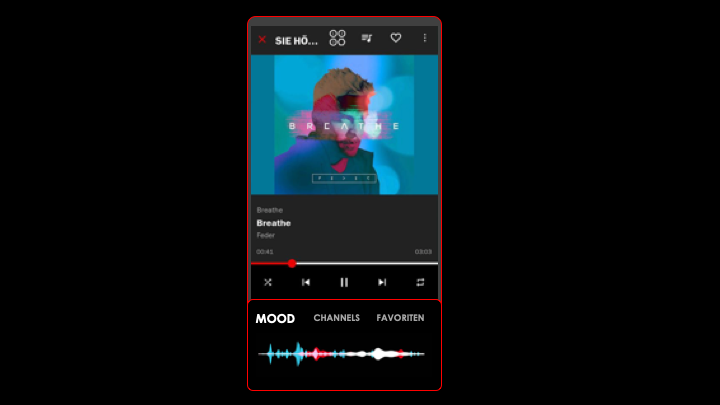
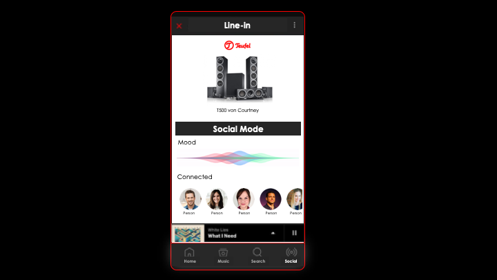
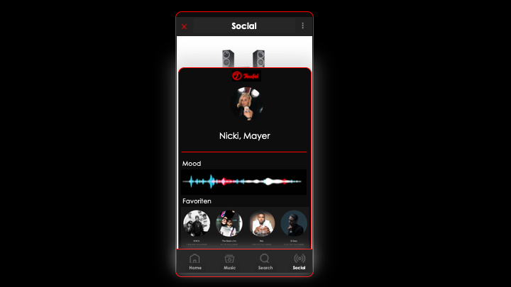

   

# Sense Users' Musical Mood, Group 11
#### Nathaniel, Florian, Alexandre, Livio, Timon

## Project description
Teufel is a German company which focuses on providing their clients with musical excitement in the form of compelling and emotional music based products. They offer a large variety of speakers and headsets; their niche in the music industry is their focus on invoking intense emotions from their consumers.

Everybody listens to music! Therefore, Teufel's goal is to propel the music industry a step further and market a more dynamic and automated music experience to the user, powered by mood prediction. They want their users to be able to be provided with music whenever and wherever they are, instead of constantly having to search through playlists to find a good song to play. We are looking for more ways to make music more enjoyable for both casual and dedicated listeners.

## Ideas

### Requirements
- Be able to find, discover, then select the next song easily
- Create a seamless music experience across multiple devices/speakers
- Reduce interaction time needed to control music devices (improve on user experience of plug in earphones/turn on home speaker, pulling out smartphone, unlock phone, open Spotify, start play button)
- No need for extra hardware (using native speaker hardware or phone)

### Personas

"Who are the users?" Music listeners are found everywhere, in the office and at home, even amongst friends. We came up with three interest groups and a concrete samples of a person that fits the given lifestyles.

#### Peter, 62

Senior System Administrator: misses the good old days of radio. Listens to a lot of music but he often gets interrupted by colleagues. Stressful job, wants to put on headphones and then just have some music going. Doesn’t want to have to bothered to get his phone constantly simply to adjust the music.

#### John, 28

Construction worker: Casually listens to music. However, if he feels like he needs some music, he just wants to put on headphones and have some good music started. Doesn’t want to devote time to search music tracks he could listen to right now. Most of the time he just listens to the weekly discovery in spotify since he doesn't has any extensive playlists.

#### Courtney, 21

Instagram Influencer: Plans out all details of her life and takes pictures of everything. Takes public transportation to move between photo shoots, cafe hopping and bringing her dog on walks. Has tons of playlists and songs saved for each given task. Listens to her specific songs given what she is doing right now and how she is feeling. She has different playlists for doing yoga, go running, studying, hanging out with friends and going to bed but also for when she feels sad, lonely or when she is happy and excited.

### Affinity Clusters

Through a brainstorming session amongst our team, we came up with some areas surrounding music and mood prediction that we wanted to explore.

#### New Software Features
- Artifical Intelligence
- Voice Control (Alexa, Siri, ...)
- Extension to existing Raumfeld App

#### Feeding the Teufel Brand
- Do it different
- Niche products
- Experimental & crazy stuff
- Fans as customers
- Direct resell to customers

#### Improving Music Experience
- Make music more enjoyable
- Boost emotions
- Improve music selection
- Support current ambience
- Suggest songs
- Reduce burden of searching for music 

#### Novel Hardware
- Mood Button
- Lightning Sensor
- Microphone

#### Engaging Moods/Emotions/Experience
- Intense, cool, fun
- Loud
- Exciting

### Key Ideas
We generated over 50 ideas in our preliminary brainstorming sessions. After we analyzed all of our potential ideas, it became apparent that there were two key areas that were the most promising. The intersection between mood prediction and music.

#### Seamless hardware-software integration
We wanted to explore how music listeners could listen to music more seamlessly.

- Quicker access to music:  If you leave the house you should have to press a minimum amount of buttons to keep the music playing on your headphones which was previously playing on the speaker. Preferably those transitions are hands-free. We also considered taking advantage of Smart Home integration. 
- Continuity: We also wanted to explore providing continuity by having the music play where you left the last time. For example if you were in the middle of an awesome playlist but interrupted by a colleague, music will continue playing when you put your headphones back on.
- Radio effect: Additionally, we wanted to look at recreating a "radio effect" where multiple people listened to the same music together, at the same time. Potentially even across large distances. The music played could be automatically determined by the common music preferences of the listeners.

#### Data-driven music
Secondly, we need to understand users through phone and sensor data such as location (GPS), date/time, seasons/holidays, local weather, calendar acvitities, activity and health data to provide a better music listening experience.

- We wanted to try and understand users through social media trends that could help us determine their overall mood and music preferences. This includes evaluating listening patterns on streaming services and understanding the user's habits such as how often music is played and what type of music according to a given context.  
- Using sensors in the phone, such as the microphone, GPS, and acceleration sensors, we can uncover more information about the mood the user may be in and provide even more accurate music predictions or suggestions to the user.

### Initial project Ideas
Given Teufel's position as an audio hardware company, we thought it was ideal that Teufel brought value to the market in terms of combining sensor data (microphones, GPS location, weather, time of day etc.) with user data (eg. music listening habits and social media profiles) to make the music listening experience even more hassle-free for Teufel users. 

Our shortlist of ideas were as follows:

1. The Big Teufel Button: A Surprise me button that features easy-to use instant-music. 
2. Blast to the Past: Reminder of music you liked to play to boost your mood. Map locations to music to bring you back on a mind trip through old times.
3. Social Music: Use information from the environment (volume, amout of people, devices nearby) to select according playlists to match the mood of all guests.

See [our presentation](Deliverables/presentation_ideas_10_18.pdf) for the detailed write-up.

### Feedback from Stakeholder
After a discussion with our stakeholder, Viktor, our contact from Teufel, we received the following feedback:  

- The "Big Teufel Button" was not a strong idea as one was quite limited in the amount of options available.
- Blast to the Past seemed to be the most emotionally compelling option, which fit well with the product goals for Teufel.
- Our Social Music idea had the biggest potential for Teufel overall and was the option most worth pursuing.

Therefore, we agreed to proceed with a focus of a social feature and the usage of sensors to detect, display and adjust a user's mood and integrate it into their music lifestyle. We therefore shifted gears and focused on builing a user interface prototype based on the existing the value proposition of the Raumfeld mobile app provided by Teufel. 

## Prototyping

### First draft

   
During the prototyping phase, we focused on the potential features and user interfaces for Teufel's Raumfeld app. The goal was to provide an interface to the user to display his current (automatically detected) mood in a readable format and give the user the possbility to adjust the default mood accordingly.

To represent the mood, we had to first find the correct keywords (attributes) that both accurately describe a given mood state and that are understandable to a general user.

Furthermore, there are multiple ways to present these attributes in a user interface. We were inspired by the brightness slider setting found in mobile phones. The default brightness is set by the system, but the user can still easily interact with a simple 1-dimensional slider to manually adjust the brightness according to his/her liking.

The first option is to display each factor seperately using one-dimensional sliders. This way the user can specifically adjust each factor separately. However, the trade off is that they may be overwhelmed by the amount of options.

The second interface uses a navigator in a 2-dimensional grid that can freely be moved around. Depending on where on the grid we find ourself, the chosen factors on the axis are taken into consideration according to the distance to the center of the grid. This allows for a very fast and easy adjustment but losing out on the option of fine-tuning each factor itself. There is also an option to gradually move the slider to the next position to achieve a smooth "mood transition".

In addition, we wanted to implement a social feature. We envisioned a platform where the mood state of multiple present people could be taken into account to create and/or adjust a playlist that is currently being played. By extending Teufel's Raumfeld music app and the current mood of the user, the user can perform a gesture with his phone towards a Teufel speaker which then takes the user's mood into account. The Raumfeld app will be able to combined data from all the connected user's preferences, analyze signals from the ambient environment, and generate a music playlist that matches the general mood of the room.

    
## Evaluating our Social Music Idea

We conducted two complementary, but separate user studies to evaluate the effectiveness of our user-interface ideas. We wanted to help various types music listeners find the right type of music for them.

### First User Study

First we wanted to find out what attributes best identify a user's mood and how best assign those factors to a given song. We found that Spotify's public API for music tracks already provide automatically generated values for some attributes, and so we wanted to see how those stacked against user perceptions.

To do so, we set up a survey that first asks the user to select factors which the user associates most with mood. We hoped that this would helped us select the attributes we would use in the user interface.

The second task provided to our respondents required users listen to three different songs, and then rate out of 10 for each music attribute listed. For example, a classic piece from Mozart is expected to have a low "danceability" rating.

After reading the musical and scientific literature on mood classification (see example [1]), the attribute words we chose to evaluate were: 
- loudness: how loud the track is
- happiness: tracks that are positivity, cheerfulness, euphoric
- speechiness: presence of spoken words in the track
- tempo: beats per minute
- energy: intensity and activity
- danceability: suitability for dancing

We conducted a survey using a web form. The results were as follows:

We then compared the attribute values that were estimated according to Spotify's public API. After triangulating the error for each attribute we got the following results:

Based on the results of the initial survey, it was not clear if there was a subset of distinguishing characteristics that users would find applicable to their tastes due to the wide spread in opinion amongst respondents. However in terms of accuracy, (compared with the Spotify-generated feature values), loudness, energy and happiness topped the list in being consistent compared to user's understandings of the attribute words.

Since the results did not give clear indications of how to proceed with selecting the relevant attributes for our prototype, we decided to conduct a second survey that focused more on a concrete instance of one of our prototypes (the 2-Dimensional Navigator). 

### Second User Study

In our second study, we chose to evaluate the effectiveness of a 2-dimensional touch interface (the "Navigator") in guiding the users to choosing the type of music that they wish to listen to. This was evaluated using music from 4 different genres (mainstream pop, rock, hip-hop/rap and instrumental). 

Respondents were asked to rate the attributes of the music they listened to on a 2-dimensional scale. We used randomization within-subjects to reduce the likelihood of ordering skewing the results in the favor of the later-presented items (to account for respondents getting more skilled at classifying music with each iteration). 

A converse case was then presented in which respondents were given a specific quadarant in a 2-dimensional attribute scale, and asked to think of a specific song in that quadrant. A reference song (generated by the Spotify public API) was then presented to them, and users were asked to rate how similar the reference song was to the one that they thought of.

The findings of the survey indicated that users are extremely divided on their opinions about the attributes of the music and are not always satisfied with the attirbutes and ratings that are automatically generated by services like the Spotify public API. This made sense because individual music tastes tend to be subjective and vary widely.

To read more about the studies conducted, please read the the Study Report, which provides full details including information about the data collected.

### Study Report

The lessons learnt from this exercise in conducting our studies indicated that closed-loop feedback would be necessary to account for the variation and unpredictability of the users' tastes in music, and that support for this closed loop would need to built into the user interface that we are designing.

Please follow the link to read our full study including results: [Study Report (pdf)](Deliverables/study_report_group_11.pdf)   

### Feedback from Stakeholder

After presenting our results to Viktor from Teufel, our stakeholder, it was decided that we should put algorithms details aside since it is a very complex area and unfortunately out of scope for the course project. Instead, our focus would be turned to designing a concept user interface that already assumes a backend sensor and database suite that is able provide accurate music prediction and mood detection services.

After discussing the user interface options that our team had been exploring, Viktor and the team agreed that the 2-Dimensional Navigator is a fast and intuitive interface for users who simply want to choose a mood quickly. However, it might not be sufficient as a standalone interface. For example, an advanced user like Courtney may wish to tweak more than two attributes to get a specific playlist vibe that she wants. Viktor therefore agreed that we the team should explore supporting an "advanced option" for users that want to adjust their mood/music setting in more detail. This can be achieved, for example, through our 1-dimensional Slider prototype and additional drop-down menu to select specific genres.

## Approaching the final solution: An Elegant User Interface for mood-prediction music software

With the outcome of the discussions with Viktor and the Teufel team in mind that we shifted our focus from exploring sensors and mood classification to developing a responsive and elegant user interface for music listeners.

We assume the availability mood data, ie. the user has provided sufficient training input about their music tastes and made available environmental sensors such that the mood of the user(s) can be predicted with reasobale accuracy. 

Another requisite feature that we learnt from user studies was the absolute need for manual closed-loop feedback in our design, to augment the variety of users and inherent difficulty in mapping user's desired mood to a generalized, objective mood classifier. The product would have designed with the principle of "Customer knows best" in mind, meaning that users should have intuitive, complete and final control of the mood selection, even if it means overriding the automatically-generated setting.

At long last, we attempted to answer the million-dollar question: How can Teufel's mobile app Raumfeld be improved to accomodate interactivity with such features?

## Final Product: A concept user interface for mood-predicted music

There are two key elements to our final product, Mood Mode (inpisre dby users like Peter) and Social Mode (inspired by users like Courtney). These are novel ways of listening to music that are designed to inspire, delight and surprise users with new music that suits the very mood that they are in, without having to press more than a few buttons to get started.

### Mood Mode

- Easily display and modify the user's current mood using the 2-dimensional Navigator interface. Users can even use the Navigator to transition between two states so that the music will adjust over time from one mood setting to the other.

- The music instantly changes when the user uses the Navigator to adjust from one position to the other. This gives the user instant feedback in a closed-feedback loop. This is important because consumer's music tastes are subjective. Therefore, a closed-loop feedback will be essential in giving users reliable and instant responsiveness to their mood adjustments.

- If a user wishes to go into pro-mode, they can use the advanced tab. This features a Slider interfaces for each attribute. This feature allows a precise selection of specific genres, and its corresponding mood attributes. This way users can generate more accurate music results which will in turn, increase consumer satisfaction. 
- Depending on the location and environment of a user, Teufel can harness data from built-in device sensors (for example: microphone, accelerometer and location input data) to dynamically adjust the mood attributes. For instance, if the user is at a loud party, attribute values correlating with the environment's mood, such as "danceability", will increase. Alternatively, if the user is in a more calm setting such as a park, attributes such as "valence" will take over as the prevalent setting. This feature can be disabled by the user if desired.

### Social Mode

- If you meet up with other people or host social events often, we recommend using our Social Mode feature. Mix the current mood and preferences with the other tech-savvy users around you. Based on the group's combined mood, the music will adjust accordingly and provide the gathering appropriately selected songs for everyone's entertainment. Hosts can also choose to override the autmatically generated mood by manually selecting one instead.

- Guests can still directly influence what music is played using a song request feature. This way guests can help the host create a playlist. However, the suggestions can be filtered by requiring them to properly align with the current mood. This is also a great feature for casual deejays who want to handle song requests on the fly. Hosts can still choose to manually accept or reject song requests through a veto setting in the app if desired.

- Users can infuse their own music preferences and mood into an ongoing Social Mode session simply by connecting their phone to a Teufel speaker. The new user's default mood settings and music preferences will be shared with the host's system and a new overall mood playlist will be generated.

- Savvy users of Teufel will no longer need to spend time haggling over what playlist to play on which phone. It will be as simple as connecting one's phone to the host speaker and Social Mode will instantly generate a mood that suits everyone's tastes. Adding song suggestions has never been easier, just queue it up and enjoy the music!

## Final Video
You can find [our Video here](Deliverables/video_final_group_11.mp4).

## Comments; in closing
Our team (Group 11) is happy to have worked with Viktor and others at Teufel and were inspired by their vision of making music even easier to listen to, for everyone. The journey was fulfilling and inspiring for us as we had hoped, and the learning process is just as valuable as if not more so than the product that we have designed. Many thanks to our TAs, David and Seonwook for their ready advice and mentorship.

## References
[1] https://sites.tufts.edu/eeseniordesignhandbook/2015/music-mood-classification/
