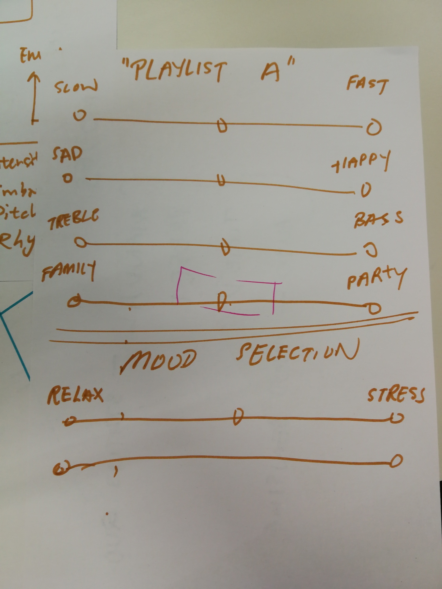

   

# Sense Users Musical Mood, Group 11
#### Nathaniel, Florian, Alexandre, Livio, Timon

## Project description
Teufel is a German company focused on providing their clients with excitement in form of music. They offer a big variety of speakers and headsets with all of them focusing on intensity and emotions.

Everybody listens to music! The goal is to bring the music system a step further and allow a more dynamic and automated music experience to the user. Instead of constantly having to search through playlists to find a good song to play the user should be provided with music whenever and wherever he is. We are looking for more ways to make music more enjoyable.

## Ideas

### Requirements
- Be able to find/discover/select the next song easily
- Create a seamless music experience across multiple devices/speakers
- Reduce interaction time needed to control music devices (improve on user experience of plug in earphones/turn on home speaker, pulling out smartphone, unlock phone, open Spotify, start play button)
- No need for extra hardware to carry with (using native speaker hardware or phone)

### Personas

Who are the users?
We came up with three interest groups and a concrete samples of a person that fits the given lifestyles.

#### Peter, 62

Senior System Administrator: misses the good old days of radio. Listens to a lot of music but he always gets interrupted by colleagues. Stressful job, wants to put on headphones and then just have some music going. Doesn’t want to be bothered getting out the phone all the time just to adjust the music.

#### John, 28

Construction worker: Casually listens to music. But if he feels like he needs some music, he just wants to put on headphones and have some good music started. Doesn’t want to search ages for some music track he could listen to right now. Most of the time he just listens to the weekly discovery in spotify since he doesn't has any extensive playlists.

#### Courtney, 21

Instagram Influencer: Plans out all details of her life and takes pictures of everything. Takes public transportation to move between photo shoots, cafe hopping and bringing her dog on walks. Has tons of playlists and songs saved for each given task. Listens to her specific songs given what she is doing right now and how she is feeling. She has different playlists for doing yoga, go running, studying, hanging out with friends and going to bed but also for when she feels sad, lonely or when she is happy and excited.

### Affinity Clusters

#### Software Features
- Artifical Intelligence
- Voice Control (Alexa, Siri, ...)
- Extension to existing Raumfeld App

#### Teufel Brand
- Do it different
- Niche products
- Experimental & crazy stuff
- Fans as customers
- Direct resell to customers

#### Music Experience
- Make music more enjoyable
- Boost emotions
- Improve music selection
- Support current ambience
- Suggest songs
- Reduce burden of searching for music 

#### Hardware
- Mood Button
- Lightning Sensor
- Microphone

#### Moods/Emotions/Experience
- Intense, cool, fun
- Loud
- Exciting

### Initial project ideas

See [our presentation](Deliverables/presentation_ideas_10_18.pdf) for the detailed write-up.

#### The Big Teufel Button
A Surprise me button that features easy-to use instant-music.

#### Blast to the Past
Reminder of music you liked to play to boost your mood. Map locations to music to bring you back on a mind trip through old times.

#### Social Music
Use information from the environment (volume, amout of people, devices nearby) to select according playlists to match the mood of all guests.

## Prototyping

### First draft

 

During prototyping we are focusing on the potential features and user interfaces for Teufel's Raumfeld app.
The goal is to provide an interface to the user to display his current (automatically detected mood) in a readable format and give the user the possbility to adjust it accordingly.
To represent the mood we have to find the right keywords to make a specific mood state understandable for the general user.

Furthermore there are multiple options on how to display those options to the user. As a reference we looked at the screen brightness settings on a smartphone. The inital brightness is detected by the system but the user can still easily interact with a slider to adjust the brightness according to his/her liking.

The first option is to dislay each factor seperately using sliders. This way the user can specifically adjust each factor separately but in return might be overwhelmed by the amount of options.

The second interface uses a navigator in a 2D grid that can freely be moved around. Depending on where on the grid we find ourself, the chosen factors on the axis are taken into consideration according to the distance to the center of the grid. This allows for a very fast and easy adjustment but losing out on the option of fine-tuning each factor itself.

    TODO: Social feature: what is it, what do we try to achieve
    
## Evaluation

In a first iteration we want to find out what factors are used best to help identify a user's mood and how to assign those factors to a given song.

To do so we set up a survey that that first asks the user to select factors that the user associates most with mood. This will help us determine which factors we should use on the interface.
In the second step the user listens to three different songs and has to determine for each given factor how much that song corresponds to a given factor. For example in a classic piece of Mozart the "dancability" factor is expected to be very low.

The attribute words we chose to evaluate were: loudness, happiness, speechiness, tempo, energy, danceability.

WE conducted a survey asking users to rate 3 songs based on these attributes. The results were as follows:

WE then compared these values to the values provided to us by Spotify:

Based on the results of the initial survey, it was not clear if there was a subset of distinguishing characteristics that users would likely be able to . There was a wide spread in opinion amongst respondents. However in terms of accuracy (compared with the Spotify-generated feature values), loudness, energy and happiness topped the list in being consistent compared to user's understandings of the attribute words.

    TODO: Describe your approach for evaluating your low-fi prototypes, present your results and your conclusion. Upload the document shared with the stakeholder to the "deliverables" folder and include the link here.

Optional: in this part you can also document the prototyping process: show different iterations, as well as failed ideas (Weeks 6-10)

## Final solution
    TODO
Describe your final solution to the problem and the prototype you developed in more detail here.
Upload your video to the "deliverables" folder and include the link here. 

(Weeks 10-14)
